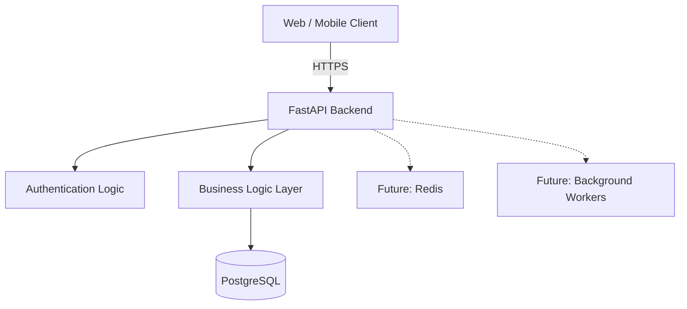
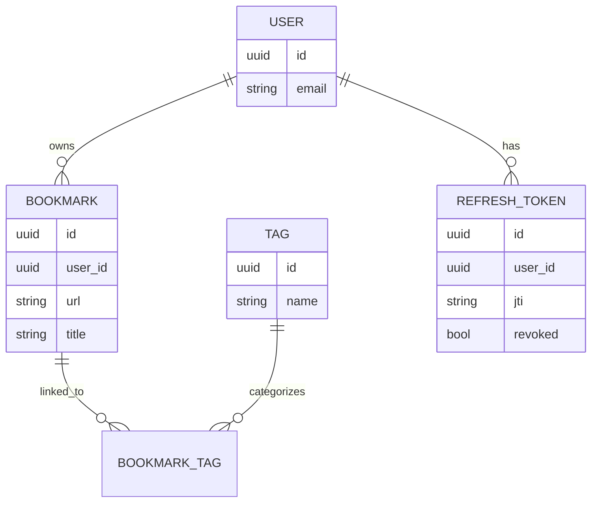

# SyncMark

SyncMark is a **scalable, security-focused bookmark management system** built as an **MVP (Minimum Viable Product)**. The project prioritizes **clean architecture, explicit tradeoffs, and future scalability**, rather than feature completeness.

---

## Key Highlights

* Stateless backend architecture designed for horizontal scaling
* Secure authentication using **JWT access tokens with refresh token rotation**
* **HTTP-only cookies** for safer token storage
* Strong relational data modeling with many-to-many relationships
* Mobile-compatible authentication and API design

---

## Project Vision

SyncMark aims to become a cross-platform bookmark manager that:

* Synchronizes data reliably across devices
* Supports offline usage with background synchronization
* Provides flexible organization through tags and future extensions
* Maintains strong security and privacy guarantees

This MVP focuses on establishing a solid architectural foundation before introducing production-scale optimizations.

---

## Tech Stack

### Backend

* **FastAPI** – REST API framework (ASGI)
* **PostgreSQL** – Primary relational database
* **SQLAlchemy ORM** – Data modeling
* **Alembic** – Database migrations
* **JWT (Access + Refresh Tokens)** – Authentication
* **HTTP-only Cookies** – Secure token storage

### Frontend

* **React (TypeScript)**
* **Redux Toolkit** – Global state management
* **RTK Query (API Slices with `injectEndpoints`)** – API communication and server-state management

---

## Frontend API Communication

The frontend uses **Redux Toolkit Query (RTK Query)** for all API communication instead of a standalone HTTP client.

### Design

* A shared **base API slice** defines base URL, credentials, and authentication behavior
* Feature modules **inject endpoints** using `injectEndpoints`
* API calls are treated as **server state**, not local component state

RTK Query automatically manages:

* Request lifecycle
* Loading and error states
* Response caching
* Cache invalidation after mutations
* Request deduplication

### Rationale

This approach reduces boilerplate and enforces consistent data-access patterns across the application. Since Redux is already used for global state, RTK Query integrates naturally and avoids duplicating state management concerns.

### Tradeoffs

* Tight coupling to Redux
* Less control over low-level request handling compared to a raw HTTP client

The tradeoff favors **predictability and correctness** over maximum flexibility, which aligns with the current stage of the application.

---

## System Design Overview

### High-Level Architecture

**Design Characteristics**

* Stateless services
* Clear separation of concerns
* Designed for incremental scalability
* Compatible with web and mobile clients

---

## Database Schema Overview

**Schema Rationale**

* Explicit join tables for many-to-many relationships
* Refresh token revocation via unique identifiers
* Extensible design for future features such as folders, sharing, and analytics

---

## Authentication Design

### Flow

1. User authenticates with credentials
2. Server issues:

   * Short-lived **access token** stored in an HTTP-only cookie
   * Long-lived **refresh token** stored in an HTTP-only cookie
3. Access token authorizes API requests
4. Refresh token rotation occurs during renewal
5. Logout revokes the refresh token server-side

### Rationale

* Reduces exposure to XSS-based token theft
* Keeps the API layer stateless
* Supports secure session invalidation
* Works consistently across web and mobile environments

---

## Key Engineering Decisions & Tradeoffs

### Modular Monolith vs Microservices

* **Chosen:** Modular monolith
* **Rationale:** Lower operational complexity and faster iteration at MVP stage
* **Tradeoff:** Less service isolation compared to microservices

### REST vs GraphQL

* **Chosen:** REST
* **Rationale:** Simpler authentication, predictable HTTP semantics, easier caching
* **Tradeoff:** Reduced client-driven query flexibility

### JWT vs Server-Side Sessions

* **Chosen:** JWT with refresh token rotation
* **Rationale:** Stateless authentication and horizontal scalability
* **Tradeoff:** Increased token lifecycle complexity

### PostgreSQL vs NoSQL

* **Chosen:** PostgreSQL
* **Rationale:** Strong relational integrity and natural support for joins
* **Tradeoff:** Requires careful indexing and scaling strategies as data grows

---

## Current Limitations

This project is not production-ready. Known limitations include:

* No rate limiting or abuse protection
* No caching layer
* No background job processing
* Limited observability and monitoring
* No CI/CD pipeline

---

## Scaling Plan (10× Growth)

Planned improvements as usage increases:

* Introduce **Redis** for caching and rate limiting
* Add **background workers** for asynchronous processing
* Use **read replicas** for PostgreSQL
* Improve observability with structured logging and metrics
* Implement device-aware session management

> This README documents architectural decisions and system behavior at the current stage of development.
